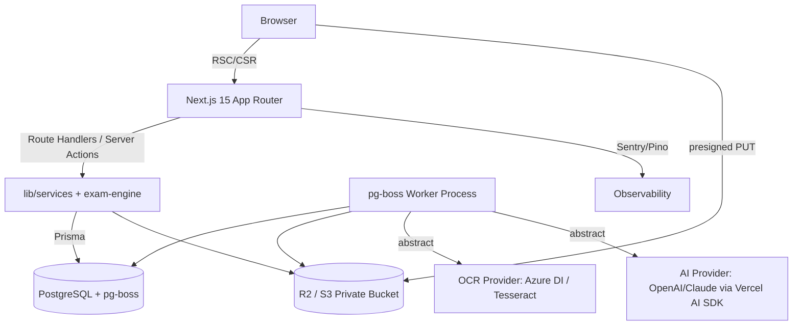
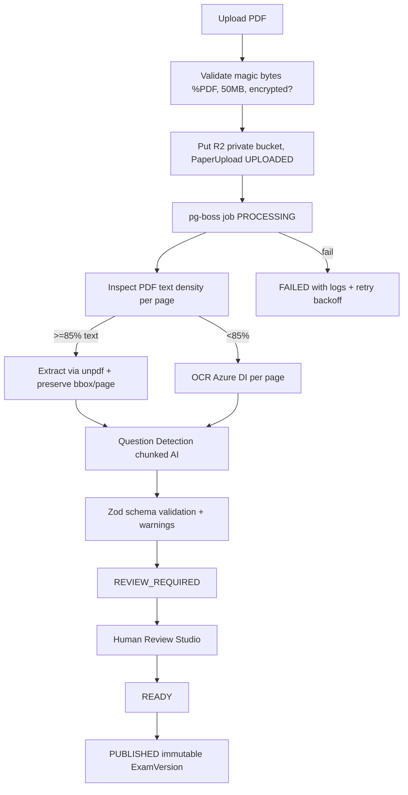

# Architecture — Exam Simulator (PracticeHub)

> Living doc — Phase 0. Update per phase. See `PRODUCT_REQUIREMENTS.md`, `DATA_MODEL.md`, `DEVELOPMENT_ROADMAP.md`.

---

## 1. Principles

1. **Config-driven Engine** — No exam-specific if/else in UI. Rules live in `ExamVersion.config` jsonb + pure engine functions.
2. **Server Authoritative** — Score, timer (`expiresAt`), publishing, AuthZ on server. Client is optimistic only.
3. **Immutable Versions** — Publishing snapshots ExamVersion; attempts FK to version, not mutable exam.
4. **Untrusted Uploads** — Magic-byte validation, private bucket, moderation gate.
5. **Review Gate for AI** — Probabilistic extraction never auto-publishes.
6. **Pure Domain Layer** — `lib/exam-engine` & `lib/services` have zero React import, fully testable.

---

## 2. High-Level Diagram



---

## 3. Technology Stack — Justified

| Layer | Choice | Reason | Alternative rejected |
|---|---|---|---|
| Frontend | Next.js 15 App Router + TS strict | RSC for library/dashboard SEO, Route Handlers colocate API, single deploy. | Separate Vite + Express adds CORS/deploy complexity for MVP |
| Styling | Tailwind CSS v4 | Perf, design tokens, shadcn native | CSS modules too verbose |
| Components | shadcn/ui + Radix | Accessible, copy-paste, no lock-in | MUI heavier |
| Math | KaTeX | Faster than MathJax, SSR, LaTeX | MathJax bigger bundle |
| DB | PostgreSQL 16 | Relational required (versioning, FK, ACID) | Mongo loses integrity |
| ORM | Prisma 6 | Migrations, DX, Auth.js adapter, Zod integration | Drizzle lighter but immature adapter |
| Auth | Auth.js v5 (NextAuth) + Prisma Adapter | Self-hosted, credentials+OAuth, RBAC | Clerk is vendor lock-in + cost |
| Validation | Zod | Single schema client/server/AI | Yup less TS |
| Storage | Cloudflare R2 (S3 compat) | Zero egress, presigned URLs | AWS S3 egress expensive |
| Jobs | pg-boss (MVP) -> BullMQ+Redis | No Redis needed early; uses existing PG. Interface abstracted. | Trigger.dev adds vendor |
| PDF text | unpdf/pdf-parse + text-density check | Avoid OCR when text exists | Regex alone brittle |
| OCR | Azure Document Intelligence primary, Tesseract fallback | Best tables + Hindi Devanagari | Tesseract alone poor with tables |
| AI | Vercel AI SDK + provider abstraction | Structured JSON via zod, swappable | Direct OpenAI SDK locks |
| State | Zustand + IndexedDB/localStorage | Minimal, persistable | Redux overkill |
| Testing | Vitest + Playwright + MSW | Unit + E2E | Jest slower |
| Logging | Pino + Sentry | Structured + error tracking | Console alone unsearchable |

Environment validation: `lib/env.ts` with `zod` parsing at boot, fails fast if missing.

---

## 4. Project Structure (planned Phase 1)

```
app/
  (public)/ page.tsx, exams/ [public]
  (auth)/ login/ register/
  (dashboard)/ dashboard/ uploads/
  exam/[examId]/ {page.tsx, attempt/[attemptId]/page.tsx}
  api/ {auth, exams, attempts, uploads, health}
components/ui/  # shadcn
lib/
  env.ts
  db.ts # Prisma client singleton
  auth.ts # Auth.js config
  exam-engine/ {scoring.ts, timer.ts, navigation.ts, states.ts, types.ts}
  services/ {exam.service.ts, attempt.service.ts, upload.service.ts}
  queue/ {queue.ts, jobs/ pdf.ts ocr.ts ai.ts}
  storage/ {r2.ts}
  validation/ {exam.schema.ts, attempt.schema.ts}
prisma/ schema.prisma
worker/ index.ts # pg-boss poller
public/
docs/
```

Domain logic lives in `lib/` — never in components.

---

## 5. Exam Engine (detail)

Config stored on `ExamVersion.config` (jsonb, validated by Zod):
```ts
type ExamConfig = {
  timing: { totalSec: number; sectionTimers?: Record<string, number>; warningSec?: number }
  marking: { perSection: Record<string, {marks:number, negative:number}>, bonusAllowed:boolean }
  navigation: { mode: 'free'|'sequential'|'section-lock'; sectionOrder?: string[] }
  palette: { states: QuestionState[] }
}
```
Pure functions:
- `canNavigate(from,to,config,attemptState) -> boolean`
- `nextQuestionState(action) -> QuestionState`
- `computeScore(attempt, version) -> Result`
- `isExpired(expiresAt) -> boolean`
Never import React.

Question types: union `type QuestionType='SCQ'|'MCQ'|'NUMERIC'|'PASSAGE'` — MVP implements SCQ only, others stub.

---

## 6. Attempt & Resilience

State machine (DB enum): `CREATED -> IN_PROGRESS -> SUBMITTED | EXPIRED | ABANDONED`.

Per-question `AttemptAnswer.state`: NOT_VISITED, NOT_ANSWERED, ANSWERED, MARKED, ANSWERED_MARKED.

Flow:
- `POST /api/attempts` creates attempt with `startedAt=now()`, `expiresAt=startedAt+totalSec`, state IN_PROGRESS.
- Client persists to IndexedDB (key `attempt:{id}`) + syncs to server every 15s + on Save&Next/Mark/Clear + `visibilitychange`/`beforeunload`.
- Recovery: on mount fetch `GET /api/attempts/:id/snapshot` (server truth for expiresAt). Merge: server answers win unless local newer `updatedAt` and still IN_PROGRESS. Guard with `If-Match` etag.
- Submit: `POST /api/attempts/:id/submit` idempotent (`Idempotency-Key` header, unique constraint). Server checks `now() <= expiresAt` else EXPIRED. Computes score in transaction, creates `ExamResult`.
- Duplicate tab: BroadcastChannel notifies, or server returns 409 if second submit.
- `expiresAt` is source of truth — client countdown is `max(0, expiresAt - Date.now())`.

---

## 7. Document Processing Pipeline



Job statuses enum: `UPLOADED, PROCESSING, OCR_PROCESSING, EXTRACTING, REVIEW_REQUIRED, READY, FAILED, PUBLISHED`.
Each job row: `logs jsonb[]`, `attempts`, `failedReason`, idempotent key = `paperUploadId`.

Pipeline avoids expensive OCR when text suffices. Mixed PDFs processed page-granularly.

Retries: exponential backoff 3x, dead-letter to `FAILED` with logs visible in admin.

---

## 8. OCR Strategy

- **Detection first:** extract text with `unpdf`; compute `textChars / (width*height)` proxy or PDF operator count. Page < threshold -> needs OCR.
- **Provider abstraction:** `interface OcrProvider { extract(buffer: Buffer, opts: {locale?}): Promise<OcrPage[]> }` with implementations `TesseractOcr` (local, cheap) and `AzureDocumentIntelligenceOcr` (tables, Hindi).
- **Bilingual:** locale hint `en|hi` passed; Azure supports `hi`; Tesseract uses `eng+hin` traineddata. MVP stores hint but renders en.
- **Output:** per-page `text + bbox + confidence + tables[]`.

---

## 9. AI Extraction Strategy

- **Chunking:** 3-5 pages per LLM call to fit context, maintain `pageOffset`.
- **Structured output:** Vercel AI SDK `generateObject({schema: ExamExtractionSchema})` where schema is Zod: `examMeta, sections[], questions[] {number, text, options[4], correctIndex?, explanation?, marks, imageRefs}`.
- **Validation:** Zod parse + custom warnings: missing options -> warning, duplicate numbers -> warning, no answer -> `needsReview=true` not invented.
- **Provider abstraction:** `interface AiProvider { extract(pages: string[]): Promise<Extraction> }` — switch OpenAI/Claude/Gemini via env.
- **Storage:** `ExtractionResult { raw: jsonb, structured: jsonb, warnings: jsonb, confidence?: number }` Linked to `ProcessingJob`.
- **Safety:** Prompt explicitly: "If unsure of answer, return null and flag needsReview. Do not invent."

---

## 10. Security

- AuthZ: `requireAuth()` + `requireRole()` on every Route Handler / Server Action. Never rely on hidden buttons. Every resource checks `ownerId` or role.
- Validation: Zod at all boundaries (body, query, params). No `any`.
- Uploads: magic-byte check (`file-type` lib), MIME sniff, size limit, encrypted PDF reject, virus scan hook later, private bucket only.
- XSS: sanitize HTML via `isomorphic-dompurify`, KaTeX auto-escapes, CSP header.
- CSRF: Next.js Server Actions have built-in CSRF; API uses `Origin` check + double-submit for mutations if needed.
- Rate limit: token bucket on `/api/auth/*`, `/api/uploads`, `/api/attempts/:id/submit` via `upstash/ratelimit` or PG table.
- IDOR: tests for accessing other user attempt by ID -> 403.
- Secrets: `lib/env.ts` server-only, never `NEXT_PUBLIC_` for keys.

---

## 11. Accessibility & Responsive

- Palette: color + icon + text + aria-label (e.g., Answered & Marked: green + bookmark icon + dotted border) — not color alone.
- Keyboard: Tab/Shift+Tab, Space to select, Arrow to navigate palette, focus ring visible.
- Semantic HTML: `<fieldset><legend>`, `<nav aria-label>`.
- Exam desktop-first (1024px+). Library/dashboard responsive grid. Exam on tablet collapses palette to drawer.

---

## 12. Deployment

- **App:** Docker (Next.js standalone output) on Fly.io / Railway / Vercel. `next build` + `prisma migrate deploy`.
- **DB:** Neon/Supabase Postgres 16 with PITR.
- **Storage:** R2 private bucket + CDN signed URLs.
- **Worker:** Separate process `pnpm worker` polling pg-boss — deployed as second service or same container with `pm2`.
- **Health:** `GET /api/health` checks DB + R2 + queue.
- **CI/CD:** GitHub Actions: `pnpm lint && pnpm typecheck && pnpm test && pnpm build`; migrations on deploy after backup.
- **Observability:** Pino JSON logs, Sentry error tracking, job logs in DB.

---

## 13. Performance

- Attempt load: fetch ExamVersion snapshot (sections+questions IDs) once; answers lazy synced. No N+1.
- 500 Q: virtualize palette (react-virtuoso), paginate questions, lazy images (next/image + R2 CDN).
- Library: Prisma cursor pagination, indexed filters (`organization`, `year`), search via `pg_trgm`.

---

## 14. Decisions Log

| Date | Decision | Rationale |
|---|---|---|
| 2026-08-23 | pg-boss over BullMQ for MVP | Avoid Redis infra, swap via interface later |
| 2026-08-23 | Auth.js over Clerk | Own data, no lock-in |
| 2026-08-23 | KaTeX over MathJax | Perf |
| 2026-08-23 | Colocated Next.js backend | Single deploy |

