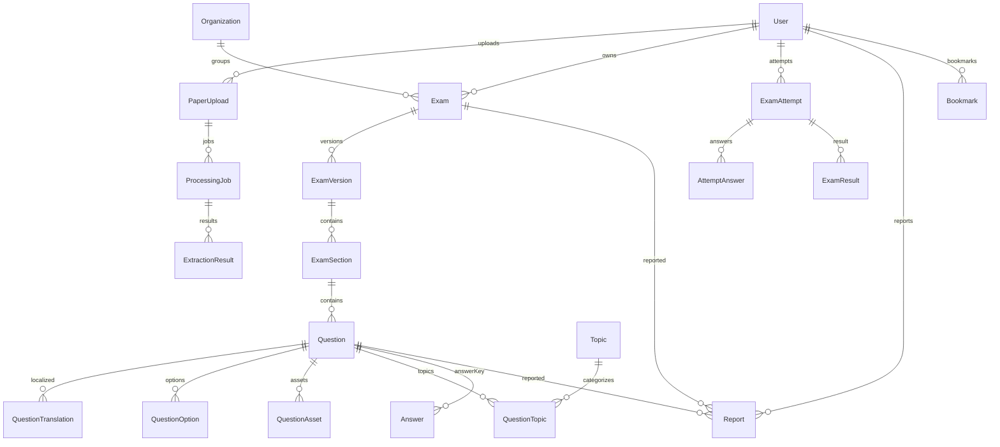

# Data Model — Exam Simulator (PracticeHub)

> Living doc — Phase 0. Prisma schema to be created in Phase 1. See `ARCHITECTURE.md`.

---

## 1. ER Overview (Mermaid)



---

## 2. Enums (PostgreSQL enums)

```prisma
enum Role { STUDENT UPLOADER MODERATOR ADMIN }
enum Visibility { PRIVATE UNLISTED PUBLIC }
enum UploadStatus { UPLOADED PROCESSING OCR_PROCESSING EXTRACTING REVIEW_REQUIRED READY FAILED PUBLISHED }
enum AttemptStatus { CREATED IN_PROGRESS SUBMITTED EXPIRED ABANDONED }
enum QuestionState { NOT_VISITED NOT_ANSWERED ANSWERED MARKED ANSWERED_MARKED }
enum QuestionType { SCQ MCQ NUMERIC TRUE_FALSE PASSAGE IMAGE_BASED }
enum ReportType { WRONG_QUESTION WRONG_ANSWER BROKEN_IMAGE FORMATTING DUPLICATE WRONG_EXPLANATION OTHER }
enum ReportStatus { OPEN RESOLVED REJECTED }
```

---

## 3. Core Tables (Prisma schema outline, Phase 1 to implement)

```prisma
model User {
  id            String   @id @default(cuid())
  email         String   @unique
  emailVerified DateTime?
  name          String?
  image         String?
  role          Role     @default(STUDENT)
  createdAt     DateTime @default(now())
  updatedAt     DateTime @updatedAt
  // relations
  exams         Exam[]
  uploads       PaperUpload[]
  attempts      ExamAttempt[]
  // Auth.js tables omitted for brevity: Account Session VerificationToken
}

model Organization {
  id        String @id @default(cuid())
  name      String @unique // e.g. SSC, IBPS
  slug      String @unique
  exams     Exam[]
}

model Exam {
  id             String     @id @default(cuid())
  slug           String     @unique
  title          String     // e.g. SSC CGL 2024 Tier-1 Shift-1
  organizationId String?
  organization   Organization? @relation(fields:[organizationId], references:[id])
  ownerId        String
  owner          User       @relation(fields:[ownerId], references:[id])
  visibility     Visibility @default(PRIVATE)
  isPublished    Boolean    @default(false)
  currentVersionId String?  @unique
  currentVersion ExamVersion? @relation("CurrentVersion", fields:[currentVersionId], references:[id])
  versions       ExamVersion[] @relation("ExamVersions")
  uploads        PaperUpload[]
  createdAt      DateTime @default(now())
  updatedAt      DateTime @updatedAt
  @@index([organizationId, isPublished])
}

model ExamVersion {
  id            String   @id @default(cuid())
  examId        String
  exam          Exam     @relation("ExamVersions", fields:[examId], references:[id], onDelete:Cascade)
  version       Int      // 1,2,3...
  config        Json     // ExamConfig (timing, marking, navigation) validated by Zod
  instructions  Json?    // rich text / markdown
  sections      ExamSection[]
  attempts      ExamAttempt[]
  createdAt     DateTime @default(now())
  @@unique([examId, version])
  @@index([examId])
}

model ExamSection {
  id            String @id @default(cuid())
  versionId     String
  version       ExamVersion @relation(fields:[versionId], references:[id], onDelete:Cascade)
  name          String // e.g. Quantitative Aptitude
  order         Int
  durationSec   Int?   // section timer
  questions     Question[]
  @@index([versionId, order])
}

model Question {
  id              String   @id @default(cuid())
  sectionId       String
  section         ExamSection @relation(fields:[sectionId], references:[id], onDelete:Cascade)
  type            QuestionType @default(SCQ)
  order           Int
  // bilingual base stored as en, translations in child table
  text            String   @db.Text // en default, KaTeX/LaTeX allowed
  explanation     String?  @db.Text
  marks           Float    @default(1)
  negativeMarks   Float    @default(0)
  isBonus         Boolean  @default(false)
  isCancelled     Boolean  @default(false)
  // passage grouping: parentQuestionId nullable for comprehension
  parentId        String?
  parent          Question? @relation("Passage", fields:[parentId], references:[id])
  children        Question[] @relation("Passage")
  translations    QuestionTranslation[]
  options         QuestionOption[]
  assets          QuestionAsset[]
  answer          Answer?
  topics          QuestionTopic[]
  @@index([sectionId, order])
}

model QuestionTranslation {
  id         String @id @default(cuid())
  questionId String
  question   Question @relation(fields:[questionId], references:[id], onDelete:Cascade)
  locale     String // en, hi
  text       String @db.Text
  // options translated via QuestionOptionTranslation if needed future
  @@unique([questionId, locale])
}

model QuestionOption {
  id         String @id @default(cuid())
  questionId String
  question   Question @relation(fields:[questionId], references:[id], onDelete:Cascade)
  label      String // A,B,C,D stored as order 0..n
  order      Int
  text       String @db.Text
  isCorrect  Boolean @default(false) // convenience, authoritative Answer table
  @@index([questionId, order])
}

model QuestionAsset {
  id         String @id @default(cuid())
  questionId String
  question   Question @relation(fields:[questionId], references:[id], onDelete:Cascade)
  url        String   // R2 key / signed URL
  type       String   // image, table, diagram
  alt        String?
  order      Int      @default(0)
}

model Answer {
  id         String @id @default(cuid())
  questionId String @unique
  question   Question @relation(fields:[questionId], references:[id], onDelete:Cascade)
  // SCQ: single optionId; MCQ: optionIds[]; NUMERIC: value range
  correctOptionId String?
  correctOptionIds String[] @default([])
  numericAnswer   Float?
  explanation     String? @db.Text
}

model Topic {
  id        String @id @default(cuid())
  name      String @unique // e.g. Percentage
  subject   String // e.g. Quantitative Aptitude
  questions QuestionTopic[]
}

model QuestionTopic {
  questionId String
  topicId    String
  question   Question @relation(fields:[questionId], references:[id], onDelete:Cascade)
  topic      Topic @relation(fields:[topicId], references:[id], onDelete:Cascade)
  @@id([questionId, topicId])
}

model PaperUpload {
  id         String @id @default(cuid())
  ownerId    String
  owner      User @relation(fields:[ownerId], references:[id])
  examId     String?
  exam       Exam? @relation(fields:[examId], references:[id])
  fileKey    String // R2 key
  fileName   String
  mimeType   String
  sizeBytes  Int
  status     UploadStatus @default(UPLOADED)
  source     String? // attribution
  jobs       ProcessingJob[]
  createdAt  DateTime @default(now())
}

model ProcessingJob {
  id            String @id @default(cuid())
  paperUploadId String
  paperUpload   PaperUpload @relation(fields:[paperUploadId], references:[id], onDelete:Cascade)
  status        UploadStatus @default(PROCESSING)
  attempts      Int @default(0)
  logs          Json[] @default([]) // {ts, level, msg}
  failedReason  String? @db.Text
  results       ExtractionResult[]
  createdAt     DateTime @default(now())
  updatedAt     DateTime @updatedAt
}

model ExtractionResult {
  id          String @id @default(cuid())
  jobId       String
  job         ProcessingJob @relation(fields:[jobId], references:[id], onDelete:Cascade)
  raw         Json? // raw OCR/AI output
  structured  Json? // Zod-validated ExamExtraction
  warnings    Json? // [{code, field, msg}]
  confidence  Float?
  createdAt   DateTime @default(now())
}

model ExamAttempt {
  id            String @id @default(cuid())
  userId        String? // null for guest ephemeral
  user          User? @relation(fields:[userId], references:[id])
  examId        String
  versionId     String
  version       ExamVersion @relation(fields:[versionId], references:[id])
  status        AttemptStatus @default(CREATED)
  startedAt     DateTime @default(now())
  expiresAt     DateTime
  submittedAt   DateTime?
  idempotencyKey String? @unique // for submit
  answers       AttemptAnswer[]
  result        ExamResult?
  createdAt     DateTime @default(now())
  updatedAt     DateTime @updatedAt
  @@index([userId, examId])
  @@index([versionId])
}

model AttemptAnswer {
  id          String @id @default(cuid())
  attemptId   String
  attempt     ExamAttempt @relation(fields:[attemptId], references:[id], onDelete:Cascade)
  questionId  String
  // denormalized snapshot of question order/text at attempt start for reproducibility
  selectedOptionId String?
  state       QuestionState @default(NOT_VISITED)
  timeSpentMs Int @default(0)
  updatedAt   DateTime @updatedAt
  @@unique([attemptId, questionId])
  @@index([attemptId])
}

model ExamResult {
  id          String @id @default(cuid())
  attemptId   String @unique
  attempt     ExamAttempt @relation(fields:[attemptId], references:[id], onDelete:Cascade)
  score       Float
  maxScore    Float
  percentage  Float
  correct     Int
  incorrect   Int
  attempted   Int
  unattempted Int
  negative    Float
  timeTakenMs Int
  sectionWise Json // [{sectionId, score, max, accuracy, attempted}]
  createdAt   DateTime @default(now())
}

model Report {
  id          String @id @default(cuid())
  reporterId  String
  reporter    User @relation(fields:[reporterId], references:[id])
  examId      String?
  questionId  String?
  type        ReportType
  description String @db.Text
  status      ReportStatus @default(OPEN)
  createdAt   DateTime @default(now())
}

model Bookmark {
  userId   String
  examId   String
  user     User @relation(fields:[userId], references:[id], onDelete:Cascade)
  exam     Exam @relation(fields:[examId], references:[id], onDelete:Cascade)
  createdAt DateTime @default(now())
  @@id([userId, examId])
}
```

---

## 4. State Machines

### Upload lifecycle
```
UPLOADED -> PROCESSING -> OCR_PROCESSING -> EXTRACTING -> REVIEW_REQUIRED -> READY -> PUBLISHED
                     \-> FAILED (retry 3x -> FAILED)
```
Transition enforced in service: `canTransition(from,to)`; illegal jumps throw.

### Attempt lifecycle
```
CREATED -> IN_PROGRESS -> SUBMITTED
                 |-> EXPIRED (now > expiresAt on submit)
                 |-> ABANDONED (heartbeat timeout 24h no submit)
```
`submittedAt` set once, idempotent. Score computed in transaction creating `ExamResult`.

### QuestionState (per AttemptAnswer)
```
NOT_VISITED --visit--> NOT_ANSWERED --select--> ANSWERED --mark--> ANSWERED_MARKED
  |                       |-> MARKED (no answer, review)
```

---

## 5. Indexing & Performance

- `Exam(slug)`, `ExamVersion(examId,version)` unique.
- `ExamSection(versionId,order)`, `Question(sectionId,order)` for ordered scan.
- `ExamAttempt(userId, examId)` for dashboard history pagination.
- `PaperUpload(ownerId, status)` for uploader queue.
- `AttemptAnswer(attemptId, questionId)` unique + index for bulk upsert.
- Full-text: `pg_trgm` on `Exam.title` for library search; later consider `tsvector`.

---

## 6. Bilingual & Math Design

- `Question.text` = canonical en. `QuestionTranslation(locale)` holds hi variant. Options similarly translatable (future `QuestionOptionTranslation`).
- Rendering: `t(locale)` picks translation else fallback en.
- Math: store LaTeX inline `$...$`, render via KaTeX on client. Assets for diagrams.

---

## 7. Versioning & Reproducibility

- Publish creates new `ExamVersion` with `version = max+1`, copies sections/questions (deep copy). `Exam.currentVersionId` points to latest.
- `ExamAttempt.versionId` pins; even if exam edited, old attempts keep snapshot. Result recomputation uses that snapshot.
- Deleting a question creates new version; old version retained.

---

## 8. 500-Question Considerations

- Bulk insert questions in single transaction (avoid N+1).
- Attempt fetch: join version->sections->questions limited to ids + text; options separate.
- Pagination/virtualization on palette; answers upsert via `createMany`.

---

## 9. Future Question Bank Extension

- `Question` can exist detached: add nullable `bankExamId` vs `sectionId` OR separate `BankQuestion` table reusing same fields. Decision deferred to Phase 14+.
- `Topic` many-to-many enables custom mock generation.

