# Development Roadmap — Exam Simulator (PracticeHub)

> Living doc — Phase 0. Approval-gated: do not start Phase N+1 without approval.

---

## Overview

18 incremental phases. Each phase: **Plan -> Approve -> Implement -> Validate (typecheck/lint/test/build) -> Demo -> Approve next**. MVP is Phases 1-6 + 12-13.

```mermaid
gantt
  title Phased Delivery (estimates, not dates)
  dateFormat X
  axisFormat %s
  section MVP
  P1 Foundation   : 0, 2
  P2 Auth         : 2, 4
  P3 Data Model   : 4, 6
  P4 Simulator UI : 6, 9
  P5 Persistence  : 9, 11
  P6 Scoring      : 11, 13
  P12 Publishing  : 13, 15
  P13 Library     : 15, 17
  section Post-MVP
  P7 Upload       : 17, 19
  P8 PDF Extract  : 19, 21
  P9 OCR          : 21, 24
  P10 AI Extract  : 24, 27
  P11 Review      : 27, 30
  P14 Analytics   : 30, 32
  P15 Moderation  : 32, 34
  P16 Hardening   : 34, 36
  P17 Testing     : 36, 38
  P18 Deploy      : 38, 40
```

---

## Phase Details

### Phase 0 — Product & Architecture Discovery [S] ✅ CURRENT

- **Objective:** Decisions + 4 docs. No code.
- **Deliverables:** PRODUCT_REQUIREMENTS, ARCHITECTURE, DATA_MODEL, DEVELOPMENT_ROADMAP.
- **Exit:** Docs approved.

### Phase 1 — Project Foundation [M]

- **Goal:** Bootable app skeleton.
- **Scope:** Next.js 15 + TS strict + Tailwind v4 + shadcn, ESLint/Prettier, env validation, folder structure, Prisma init + Postgres (Neon/Supabase), migration system, base layout, design primitives (buttons/inputs/card/dialog/badge/alert/skeleton), CI checks.
- **Not:** Auth, domain logic.
- **Validation:** `pnpm typecheck && lint && build` passes.
- **Risks:** Tailwind v4 breaking shadcn — pin versions.

### Phase 2 — Authentication & User System [M]

- **Goal:** Secure auth + RBAC.
- **Scope:** Auth.js v5, Prisma adapter, credentials+Google, signup/login/logout, session handling, protected routes (`middleware.ts`), `User.role` enum, `requireAuth/requireRole` guards, guest strategy, profile page.
- **Tests:** AuthZ: student cannot access admin API (unit + integration).
- **Exit:** Sign up, log in, role guard works.

### Phase 3 — Exam Data Model & Exam Engine [L]

- **Goal:** Config-driven domain.
- **Scope:** Prisma schema for Exam/Version/Section/Question/Option/Asset/Answer/Instructions, enums, config Zod schemas (timing/marking/navigation), pure engine `lib/exam-engine/*` (scoring, timer, navigation, state), idempotent versioning, seed script for 1-2 sample exams (SSC mock). Admin/dev tooling to create exam manually.
- **Tests:** Scoring with negative/bonus, timer expiry, navigation rules.
- **Exit:** `prisma migrate` OK, seed creates publishable exam, engine unit tests green.

### Phase 4 — Exam Simulator UI [L]

- **Goal:** Realistic CBT feel, no processing yet.
- **Scope:** Instructions screen, header+timer, section tabs, question viewer, options, palette (5 states, a11y), controls: Save&Next/Prev/Clear/Mark&Next, palette nav, confirm dialogs, fullscreen toggle, responsive palette drawer.
- **Uses:** Seeded exams from P3.
- **Tests:** Palette state transitions, navigation guard.
- **Exit:** Can complete a seeded exam visually, states correct.

### Phase 5 — Attempt Persistence & Recovery [L]

- **Goal:** Resilience.
- **Scope:** `ExamAttempt`, `AttemptAnswer` tables, lifecycle state machine, local persistence (Zustand + IndexedDB), sync every 15s + on change, snapshot recovery, `expiresAt` authoritative, idempotent submit, duplicate-tab 409, auto-submit on expiry, offline queue.
- **Tests:** Refresh recovery, expiry auto-submit, double submit idempotent.
- **Exit:** E2E: answer 20, refresh, still 20, timer correct.

### Phase 6 — Scoring & Results [M]

- **Goal:** Server truth results.
- **Scope:** `computeScore` server, `ExamResult` creation in transaction, section-wise, result page (summary cards + question review + time per Q), correct/incorrect highlight, explanation display.
- **Tests:** Exhaustive scoring: correct/incorrect/skipped/bonus/cancelled/negative/section timers.
- **Exit:** Scores match manual calc, result page complete.

### Phase 7 — File Upload Pipeline [M]

- **Goal:** Secure upload + job system.
- **Scope:** R2 setup, presigned PUT, magic-byte validation, PaperUpload + ProcessingJob tables, statuses, job queue (pg-boss), upload UI with progress + polling, failure UI.
- **Not:** Extraction yet.
- **Exit:** PDF upload -> UPLOADED -> job row created, admin sees logs.

### Phase 8 — PDF Text Extraction [M]

- **Goal:** Handle text PDFs without OCR.
- **Scope:** Inspect PDF (text density heuristic), extract via unpdf (preserve page/bbox), store ExtractionResult raw+structured, logs, handling mixed docs.
- **Exit:** Text PDF extracts and shows page-aware output, not OCRed.

### Phase 9 — OCR for Scanned Papers [L]

- **Goal:** Scanned/image PDFs.
- **Scope:** OcrProvider abstraction, Tesseract local + Azure DI integration, per-page language hint, mixed PDF handling, avoid OCR when text suffices, confidence.
- **Exit:** Scanned 10-page paper OCRs with tables; text PDF still skips OCR.

### Phase 10 — AI Question Extraction [XL]

- **Goal:** Raw text -> structured exam.
- **Scope:** Chunked LLM calls, strict Zod schema (question number, text, options, answer, section, warnings), validation, confidence/needsReview, raw+structured storage, no invented answers.
- **Exit:** Sample PYQ extracts with >80% option accuracy and warnings for low confidence.

### Phase 11 — Review & Correction Studio [XL]

- **Goal:** Human correction before publish.
- **Scope:** Split view PDF vs extracted, edit all fields, reorder/delete/add, image replace, LaTeX, marks, section, warnings UI, validation blocking publish.
- **Exit:** Can fix extraction fully and publish.

### Phase 12 — Exam Publishing Workflow [M] (part of MVP, but after P6)

- **Goal:** Safe publish.
- **Scope:** State Draft->Review->Ready->Published, visibility private/unlisted/public, validation gate, immutable version creation, unpublish.
- **Exit:** Invalid exam cannot publish; version immutable.

### Phase 13 — Exam Library [M]

- **Goal:** Discovery.
- **Scope:** Searchable library, filters (org/exam/year/stage/shift), sorting, pagination, search (pg_trgm), empty states.
- **Exit:** Library filters and pagination work with seeded data.

### Phase 14 — Student Dashboard & Analytics [L]

- **Goal:** Meaningful insights.
- **Scope:** Attempt history, avg score/accuracy, strongest/weakest, recent, trends (charts), section perf, time analysis.
- **Exit:** Dashboard shows trends for 5+ attempts.

### Phase 15 — Moderation & Reporting [M]

- **Goal:** Trust.
- **Scope:** Question/paper reports, queue, resolve, version bump, takedown, attribution.
- **Exit:** Report -> moderator fixes -> version bump.

### Phase 16 — Security & Reliability Hardening [L]

- **Goal:** Production readiness.
- **Scope:** Audit authZ, IDOR, XSS, injection, upload spoofing, rate limits, race conditions, timer exploits, API validation, add Sentry, structured logs.
- **Exit:** No critical findings, rate limits active.

### Phase 17 — Testing & Performance [L]

- **Goal:** Confidence.
- **Scope:** Expand unit/integration/E2E, realistic 500Q perf test, concurrent attempts, processing load.
- **Exit:** E2E 2 flows green, 500Q <100ms nav.

### Phase 18 — Deployment & Production Readiness [M]

- **Goal:** Live.
- **Scope:** Prod env, migrations, R2, worker service, monitoring, backups, health checks, CI/CD, deployment docs.
- **Exit:** Deployed staging with health check, backup verified.

---

## Dependency Graph

- P2 depends on P1. P3 on P2. P4 on P3. P5 on P4. P6 on P5.
- P7-11 chain depends on P6. P12-13 depend on P6 (so can run parallel to P7-11 if team size permits). P14 depends on P6/P13. P15 on P12-13. P16-18 on all.

---

## MVP Cut Line

MVP = P1-6 + P12-13. Post-MVP starts P7. Rationale in ARCHITECTURE.md. Can reorder P7-11 after CE validation if you want upload earlier — requires approval.

---

## Per-Phase Approval Checklist

Each phase must present:

- Files to create/change, arch decisions, deps, DB changes, risks, completion criteria.
- After implementation: typecheck/lint/test/build results + known limitations + next phase plan.

---

## Risks per Phase

- **P9 OCR:** Cost of Azure DI — mitigate with abstraction + local fallback.
- **P10 AI:** Hallucinations — enforce Zod + review gate.
- **P5 Resilience:** Clock skew — server expiresAt only.
- **P11 Review Studio:** Complex UX — build incrementally, test with real PYQ early.

---

## Documentation Maintenance

- Update relevant doc per phase (e.g., P3 updates DATA_MODEL.md).
- README.md always points to docs.
- Keep Mermaid diagrams in sync.
